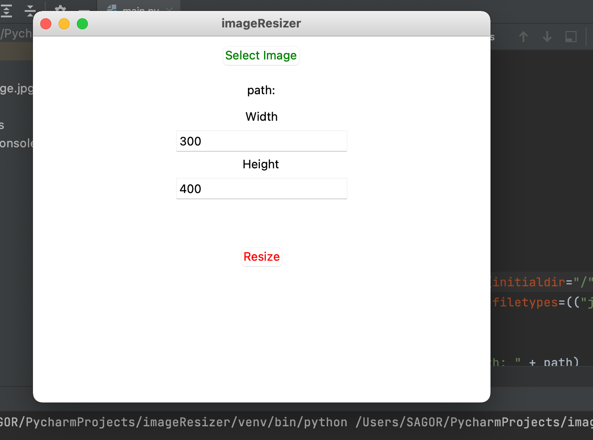

# imageResizer
A very simple GUI application, where you can easily resize your 
picture at your own satisfaction. One thing is recommended for
this action is to maintain your raw picture's aspect ratio according
to your finale picture, so that the final picture don't get shrink!

# Requirements:
**Sockets (pip install tk)**

**Tkinter (pip install Pillow)**

# Demonstration:
